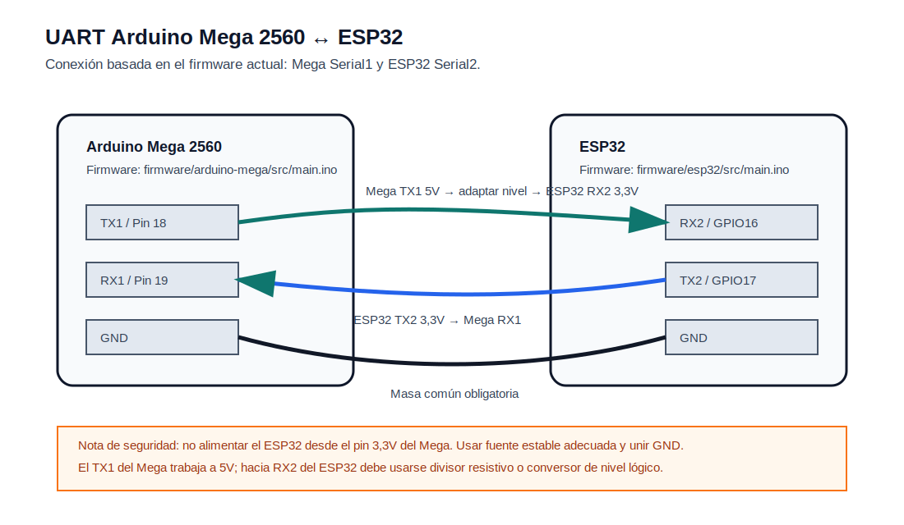
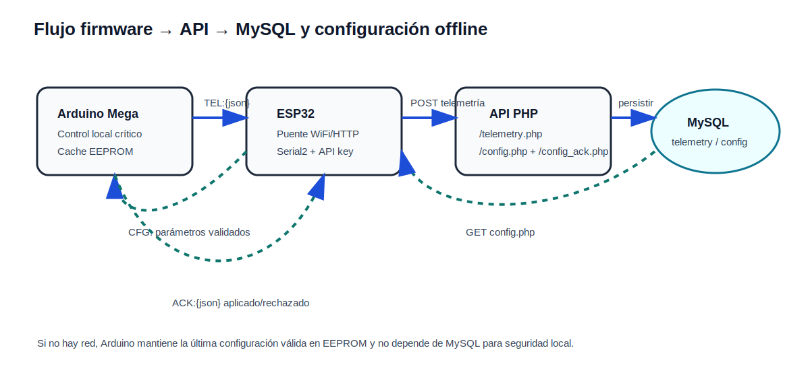
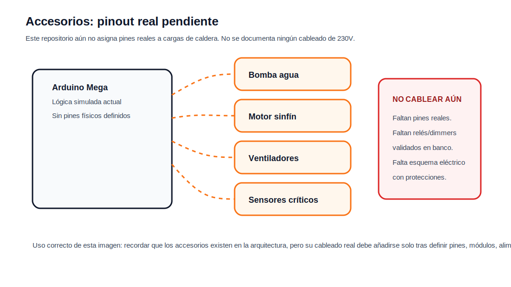

# Conexiones documentadas

## Criterio de seguridad

Este documento solo recoge conexiones que están respaldadas por el firmware o por una advertencia explícita de que aún no deben cablearse.

No se documentan pines de bomba, sinfín, ventiladores, dimmers, relés ni sensores críticos porque todavía no existe un pinout real validado en banco dentro del repositorio.

## Arduino Mega 2560 ↔ ESP32

La conexión real documentada actualmente es el enlace UART entre placas.

Conexiones:

| Origen | Destino | Nota |
| --- | --- | --- |
| Arduino Mega TX1 / Pin 18 | ESP32 RX2 / GPIO16 | Requiere adaptación de nivel de 5V a 3,3V. |
| ESP32 TX2 / GPIO17 | Arduino Mega RX1 / Pin 19 | Señal 3,3V hacia entrada del Mega. |
| Arduino Mega GND | ESP32 GND | Masa común obligatoria. |

No alimentes el ESP32 desde el pin 3,3V del Mega. Usa una fuente estable adecuada para ESP32 y comparte GND.

## Flujo de datos

El flujo real implementado en firmware y API es:

1. Arduino Mega envía `TEL:{json}` al ESP32.
2. ESP32 publica el JSON en `POST /api/telemetry.php`.
3. ESP32 consulta `GET /api/config.php?device_id=caldera-01`.
4. ESP32 transforma la configuración en `CFG:` y la envía al Arduino.
5. Arduino valida, cachea en EEPROM y responde `ACK:{json}`.
6. ESP32 reenvía el ACK a `POST /api/config_ack.php`.

## Accesorios de caldera

El estado actual de accesorios es intencionadamente conservador:

No hay pinout real versionado para:

- bomba de agua,
- motor del sinfín,
- ventiladores,
- dimmers,
- relés de potencia,
- termopares o sensores definitivos,
- cadena de seguridad física.

Hasta que se añada un esquema eléctrico validado, cualquier conexión de 230V o carga real queda fuera de alcance del firmware actual.
